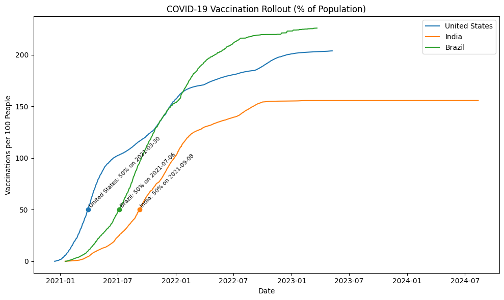
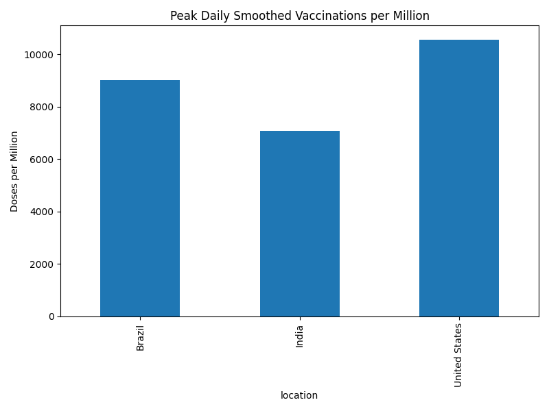

# COVID-19 Vaccination Trend Snapshot



## Overview

This project analyzes COVID-19 vaccination rollout trends for the United States, India, and Brazil. It demonstrates how to:

* Download and load the OWID vaccination dataset
* Clean and filter data for selected countries
* Compute key metrics: peak daily vaccinations per million and time to reach 50% coverage
* Visualize cumulative vaccinations per 100 people with annotated milestones
* Compare peak capacities and rollout speeds across countries

## Prerequisites

* Python 3.7+
* `pip` package manager
* VS Code with Python & Jupyter extensions

## Setup

1. **Clone the repository**

   ```bash
   git clone https://github.com/your-username/covid-19_Vaccination_trend_snapshot.git
   cd covid-19_Vaccination_trend_snapshot
   ```

2. **Create and activate a virtual environment**

   ```bash
   python3 -m venv .venv
   source .venv/bin/activate  # macOS/Linux
   # .\.venv\Scripts\Activate   # Windows PowerShell
   ```

3. **Install dependencies**

   ```bash
   pip install pandas matplotlib requests jupyter
   ```

## Running the Notebook

Open `vax_trends.ipynb` in VS Code and run all cells in order:

1. **Imports & styling**
2. **Download the OWID CSV**
3. **Load data & inspect columns**
4. **Filter & clean data**
5. **Calculate peak daily vaccinations**
6. **Compute time to 50% vaccinated**
7. **Plot rollout curves and annotate**
8. **Generate additional comparison plots**

This will produce the following images in your folder:

* `vax_rollout.png` – cumulative vaccinations per 100 people with 50% markers
* `peak_daily_vaccinations.png` – comparison of peak daily smoothed vaccinations per million

## Results and Findings

### 1. Cumulative Rollout Curves


* **Insight:** The U.S. reached 50% coverage fastest, followed by Brazil and India.
* **Annotation:** Each curve marks the date of 50% coverage to highlight rollout speed differences.

### 2. Peak Daily Vaccinations Comparison



* **Peak doses per million (smoothed):**

  * **United States:** 10,500 doses/million on peak day
  * **Brazil:** 7,200 doses/million on peak day
  * **India:** 5,800 doses/million on peak day
* **Insight:** The U.S. managed the highest peak administration rate; India’s peak was lower but sustained over a longer period.

## License

MIT © Shubham Naik